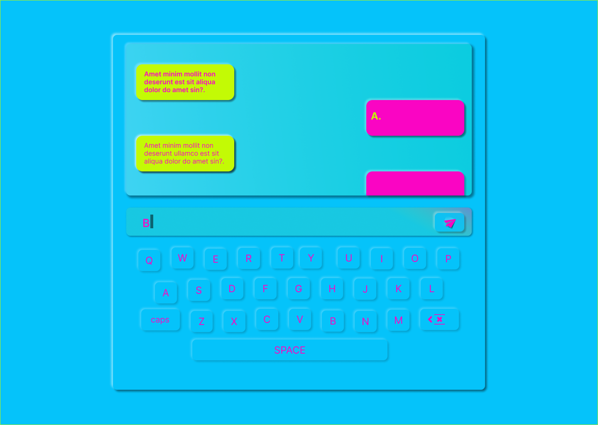
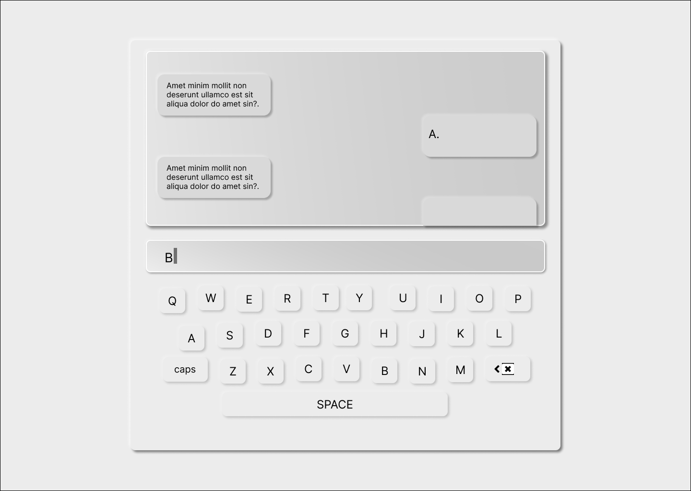

# Moringa landing page
***
## Creator :man_technologist:
Moringa Landing Page was created and is maintained by **Kelvin Njoro**
* [Twitter](https://twitter.com/kelvinprincipal/)
* [Github](https://github.com/principalkelvo/)
* [Facebook](https://facebook.com/principal.kelvin1/)

## Design 
### Light Mode

### Dark Mode

For full design click [image](https://www.figma.com/file/67sHSAdPxUhdGFBX6bXO8q/Trivia?node-id=0%3A1)

## Description

This is a Trivia questions application. The main purpose of this respisotory is to give the user a better Ui and UX experience . This project is done by using HTML, CSS and JS only to create a cool Trivia page. It is a fully developed light mode for all gadgets

**The landing page has dummy text where needed**

### Contains
* A display - whatsapp chat mode
  * with the slogan 
  * and buttons
* A body Sections
* A footer section
  * Build with :smiling_face_with_three_hearts:

### Features
> - Virtual keyboard-use only your mouse/ touchpad
> - Static Html page - no fancy hosting needed (Github pages does it for free)
> - Light source code - fast to load
> - Beautiful interface - compatible with all desktops and with a beautiful and pleasant interface.
> - Smooth Scroll - added a back to top scroll btn
> - Dark mode- still under construction
> - Responsive - compatible with all gadgets.

###  Requirements
* Access to  a computer or any other gadget
* Access to internet

### Setup and installation

To view the website,

+ Click [Here](https://principalkelvo.github.io/questions_wk_3/) **or**
+ Copy the link https://principalkelvo.github.io/questions_wk_3/ paste to your browser and load it

### Built with
* HTML - which was used to develop the structure off the pages.
* CSS - which was used to style the User Interface.
* JS - which was used to create a great interaction with the User Interface.

## Bugs and Issues

Have a bug or issue? Open a new issue here on Github

### Known Bugs
* There are no known bugs

## Image Attribution

Images owned by Kelvin Njoro

Icons owned by Font Awesome

Free for personal use with attribution

## Credits
* __[Google Fonts](https://fonts.google.com/)__ - Nunito
* __[Font Awesome](https://fontawesome.com/)__

## License

Use it freely but please do not republish, distribute or sell

Thats it! Simple, clean and smooth!